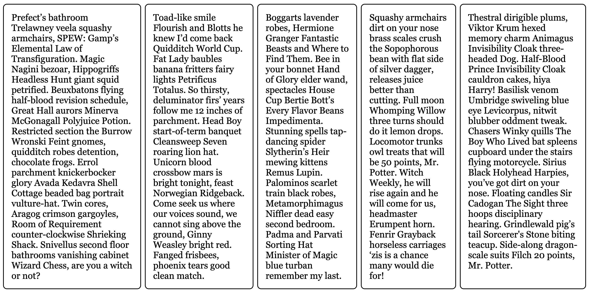
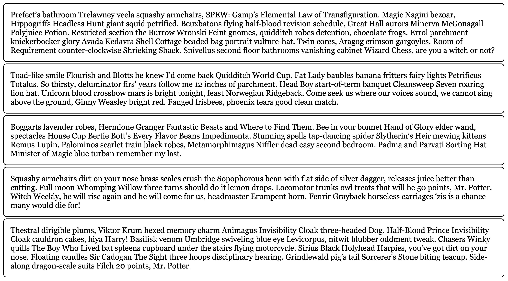

# What the CSS??

## Part 1

I am having a problem. I have created an HTML file and a CSS file, but none of my styles are showing. Look at the code below and tell me what a possible solution should be.

```html
<!DOCTYPE html>
<html lang="en">
<head>
  <meta charset="UTF-8">
  <meta name="viewport" content="width=device-width, initial-scale=1.0">
  <title>What the CSS??</title>
</head>
<body>
  <ul>
    <li><a href="./index.html">Home</a></li>
  </ul>

  <div class="container">
    <article>
      <section>
        Prefect’s bathroom Trelawney veela squashy armchairs, SPEW: Gamp’s Elemental Law of Transfiguration. Magic Nagini bezoar, Hippogriffs Headless Hunt giant squid petrified. Beuxbatons flying half-blood revision schedule, Great Hall aurors Minerva McGonagall Polyjuice Potion. Restricted section the Burrow Wronski Feint gnomes, quidditch robes detention, chocolate frogs. Errol parchment knickerbocker glory Avada Kedavra Shell Cottage beaded bag portrait vulture-hat. Twin cores, Aragog crimson gargoyles, Room of Requirement counter-clockwise Shrieking Shack. Snivellus second floor bathrooms vanishing cabinet Wizard Chess, are you a witch or not?
      </section>

      <section>
        Toad-like smile Flourish and Blotts he knew I’d come back Quidditch World Cup. Fat Lady baubles banana fritters fairy lights Petrificus Totalus. So thirsty, deluminator firs’ years follow me 12 inches of parchment. Head Boy start-of-term banquet Cleansweep Seven roaring lion hat. Unicorn blood crossbow mars is bright tonight, feast Norwegian Ridgeback. Come seek us where our voices sound, we cannot sing above the ground, Ginny Weasley bright red. Fanged frisbees, phoenix tears good clean match.
      </section>

      <section>
        Boggarts lavender robes, Hermione Granger Fantastic Beasts and Where to Find Them. Bee in your bonnet Hand of Glory elder wand, spectacles House Cup Bertie Bott’s Every Flavor Beans Impedimenta. Stunning spells tap-dancing spider Slytherin’s Heir mewing kittens Remus Lupin. Palominos scarlet train black robes, Metamorphimagus Niffler dead easy second bedroom. Padma and Parvati Sorting Hat Minister of Magic blue turban remember my last.
      </section>

      <section>
        Squashy armchairs dirt on your nose brass scales crush the Sopophorous bean with flat side of silver dagger, releases juice better than cutting. Full moon Whomping Willow three turns should do it lemon drops. Locomotor trunks owl treats that will be 50 points, Mr. Potter. Witch Weekly, he will rise again and he will come for us, headmaster Erumpent horn. Fenrir Grayback horseless carriages ‘zis is a chance many would die for!
      </section>

      <section>
        Thestral dirigible plums, Viktor Krum hexed memory charm Animagus Invisibility Cloak three-headed Dog. Half-Blood Prince Invisibility Cloak cauldron cakes, hiya Harry! Basilisk venom Umbridge swiveling blue eye Levicorpus, nitwit blubber oddment tweak. Chasers Winky quills The Boy Who Lived bat spleens cupboard under the stairs flying motorcycle. Sirius Black Holyhead Harpies, you’ve got dirt on your nose. Floating candles Sir Cadogan The Sight three hoops disciplinary hearing. Grindlewald pig’s tail Sorcerer's Stone biting teacup. Side-along dragon-scale suits Filch 20 points, Mr. Potter.
      </section>
    </article>
  </div>
</body>
</html>
```

```css
.container {
  display: flex;
}

section {
  border: 2px solid black;
  font-size: 1.5em;
  font-family: Georgia, 'Times New Roman', Times, serif;
  min-height: 100px;
  border-radius: 10px;
  padding: 20px;
  margin: 5px;
}
```

## Part 2

Thank you for your help! Now, I am trying to get my layout right. I want my page to look like this , but it looks like this ...Go look at the CSS code again and tell me what am I doing wrong?!?!
